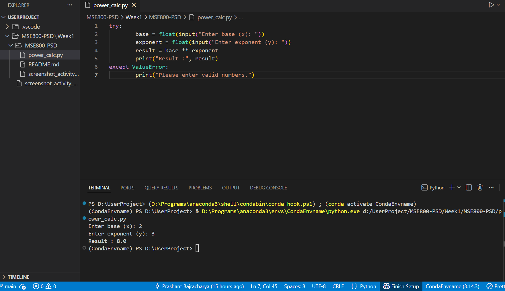

# Week 1 - Activity 3 : Power Calculator Project 

## Description

A simple Python script designed to calculate the power of a number x raised to y. This project demonstrates basic input handling and mathematical operations.

## Environment & Results
Below is a screenshot of the code running in my environment:

