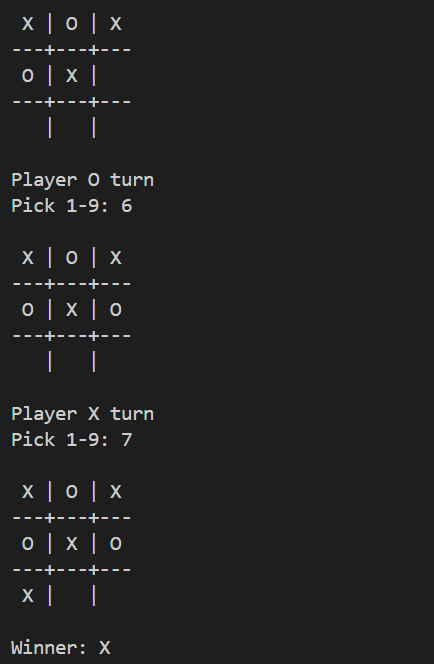
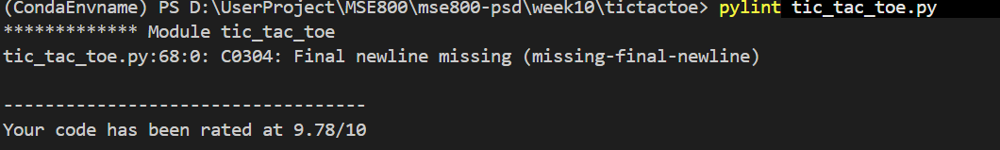

# Activity 2 — Tic-tac-toe (Console)

A simple two-player command-line Tic-tac-toe game written in Python. Players take turns marking positions on a 3×3 grid; the first to line up three in a row (horizontally, vertically, or diagonally) wins.

## Features

* **Two-player local play (X vs O):** Automatically alternates turns between players.
* **Numbered position guide (1–9):** Input mapping.
* **Input validation:** Rejects non-numeric choices, out-of-range inputs, or already occupied position.
* **Win and draw detection:** Ends the game immediately when a win condition is matched.

## Project Layout

| File | Responsibility |
| :--- | :--- |
| `tic_tac_toe.py` | Handles game logic, board rendering, input validation, and the console game loop. |

## Run

```bash
python tic_tac_toe.py
```
## Screeshot
### Game Run

### Pylint Score
