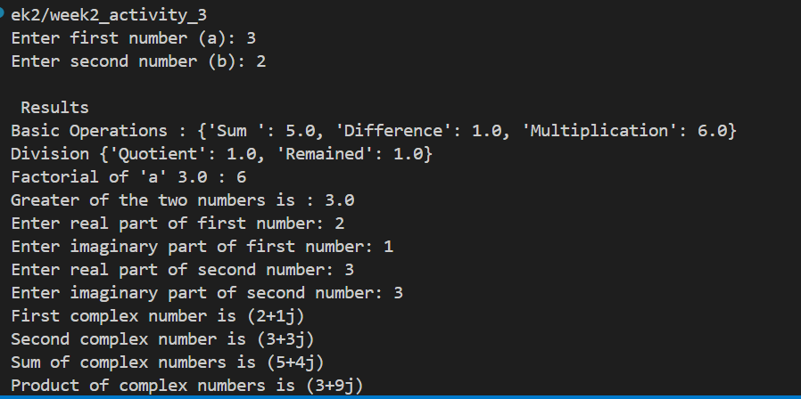

# Week 1 - Activity 3 : Mathematical Operations implementin object-oriented concepts
A Python-based calculator that demonstrates Object-Oriented Programming (OOP) principles. The program performs basic mathematical operations, and complex number calculations using a structured class-and-function approach.

## Features
Basic Arithmetic : Calculate sum, differece and multiplication.  
Integer Division : Return both Quotient and Remainder.  
Factorial : Calculate factorial of the first input number.  
Comparision : Display the greater of the two numbers.  
Complex Numbers : Get inputs for complex numbers and perform addition and multiplicaiton.  

## Code Structure
1. Class   
    ### BasicOperations
    Methods : operations(), division(), factorial() and greater_num()

2. Functions  
    get_numbers() : Get input of two numbers for various operations.  
    get_complex_numbers() : Get numbers to form complex and and perform sum and multiplication.  

3. Execution
    ### main()

## Result
